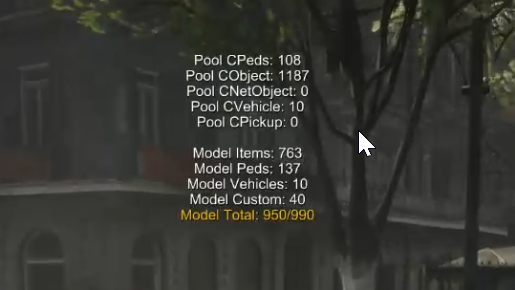

# olrp-debug
Debugging tool for RedM servers, displaying rendered assets.

## Problem
You're getting 'RAGE error: 0x9952DB5E:212' crashes on your RedM server when too many assets are loaded at once.

If you're like me, I was trying to work out why my server kept crashing dispite not having that many MLO's or props loaded - or so I thought! So a big shoutout to the [SPOONI](https://discord.com/invite/spooni) team who kindly talked me through how the ydr files load so that I could get me head around it. 

This mods shows you how many model files are currently loaded and unloaded by your client as you walk around the game. SPOONI have advised that 990 props seems to be the maximum number of props that are safe to load, and anything 991+ risks causing a crash.

## Usage
1. Download this resource 
2. Place the **olrp-debug** folder in your resources/ folder on your RedM server
3. In your **server.cfg** file, type `ensure olrp-debug`
4. You now need to generate a list of .YDR files that you're loading as part of your custom mods, to do so, launch powershell in Windows and execute the following code:
   ``Get-ChildItem -Path C:\GitHub\my-server-location-here\resources -Filter *.ydr -Recurse -File| ForEach-Object { "`"$($_.BaseName)`"," } | Sort-Object -Descending``

   You should see the output of all YDR models below which you now need to highlight and copy.

   
5. Go to `entities/custom.json` and **replace** the existing list with the list you have just copied.
6. Restart your server
7. Launch in game and type `/showmodels` in the chat or command window. You can toggle this tool on and off with this same command.

   

> [!IMPORTANT]
> You will need to repeat steps 4-6 every time you add or remove any resources. This script only works by having a list of all assets and counting if they are loaded in game. If you do not update the custom.json list regularly, the output of this tool may be inaccurate.

## Demo video

