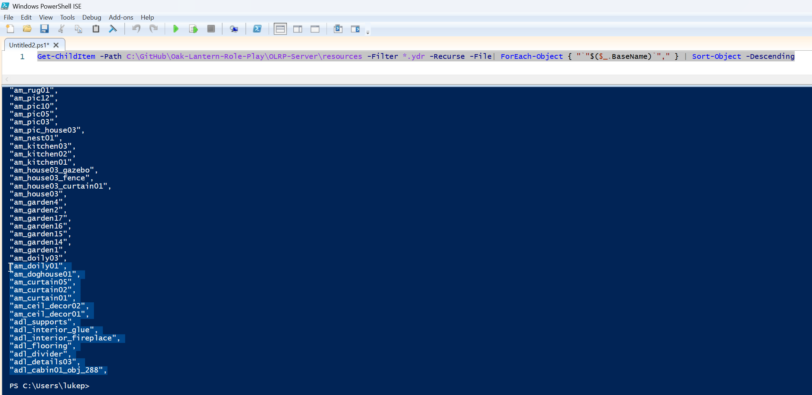

# olrp-debug
Debugging tool for RedM servers, displaying rendered assets.

## Problem
You're getting 'RAGE error: 0x9952DB5E:212' crashes on your RedM server.

## Usage
1. Download this resource 
2. Place the **olrp-debug** folder in your resources/ folder on your RedM server
3. In your **server.cfg** file, type **ensure olrp-debug**
4. You now need to generate a list of .YDR files that you're loading as part of your custom mods, to do so, launch powershell in Windows and execute the following code:
   `Get-ChildItem -Path C:\GitHub\my-server-location-here\resources -Filter *.ydr -Recurse -File| ForEach-Object { "``"$($_.BaseName)``"," } | Sort-Object -Descending`
   
   You should see the output of all YDR models below which you now need to highlight and copy.
   
5. Go to `entities/custom.json` and **replace** the existing list with the list you have just copied.
6. Restart your server
7. Launch in game and type `/showmodels` in the chat or command window. You can toggle this tool on and off with this same command.

[!NOTE]
You will need to repeat steps 4 and 5 every time you add or remove any resources. This script only works by having a list of all assets and counting if they are loaded in game. If you do not update the custom.json list regularly, the output of this tool may be inaccurate.

## Demo video

